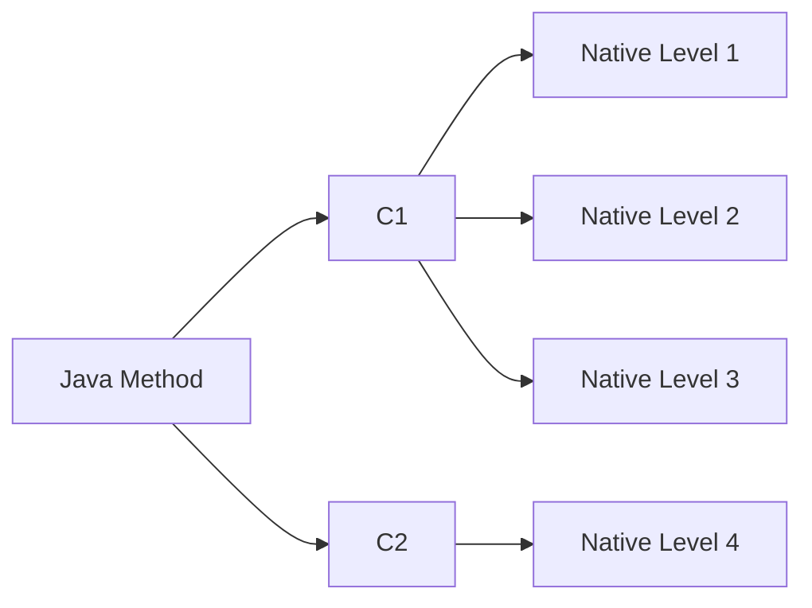

# java performance tunning


- choose right jvm
- programming/execution environment

## JIT and Code cache

- Main.java -> javac -> Main.class (compiles)
- JVM interpreter Main.class
- Just in time compilation (JIT)
  - branch runs often
  - jvm decides to compile into native code specific for OS (runs faster)
  - Code runs faster the longer it is left to run (long-running apps gets profiled by jvm)
  - any code block of code can be JIT compile
  - `-XX:+PrintCompilation` show which compilation is being made


### example of `-XX:+PrintCompilation`

```txt
    24    1       3       java.util.concurrent.ConcurrentHashMap::tabAt (22 bytes)
     24    3     n 0       jdk.internal.misc.Unsafe::getObjectVolatile (native)   
     25    2       3       jdk.internal.misc.Unsafe::getObjectAcquire (7 bytes)
```

- first column: number of milliseconds since JVM started
- second column: order method compiled
- third column: 
  - `n` means native method
  - `s` synchronized method
  - `!` exception
  - `%` code cache
- fourth column: number of what kind of compiler [1-4]
- last column: method being called




- Jvm decides which level should be used, more used higher the probability to increase the level
- To save into a log file = `-XX:+UnlockDiagnosticVMOptions -XX:+LogCompilation`

### Code cache

- Set the code cache:
  - `-XX:InitialCodeCacheSize=28M` when app starts eg: 
  - `-XX:ReservedCodeCacheSize` max code cache
  - `-XX:CodeCacheExpansionSize` how fast the cache show grow
- Warning if the code cache is full: `VM warning: CodeCache is full.`
- `-XX:+PrintCodeCache` shows the code cache usage and available
  - java8+ code cache up to 240MB
