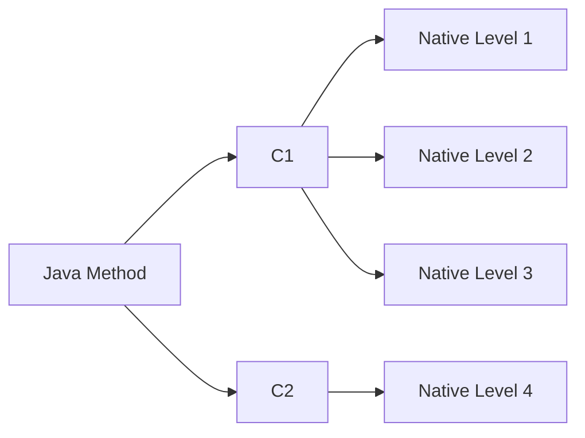
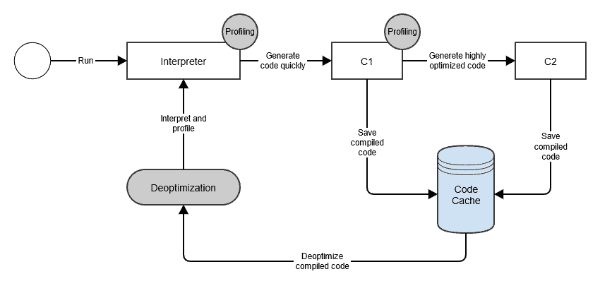
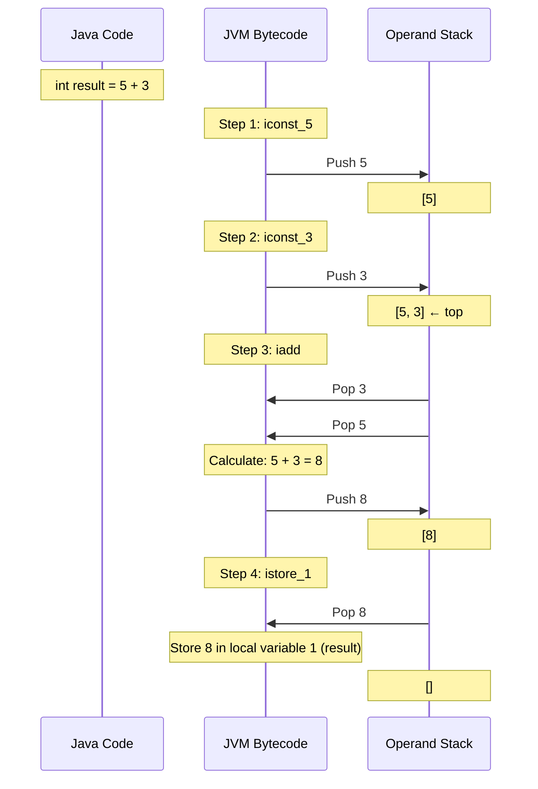
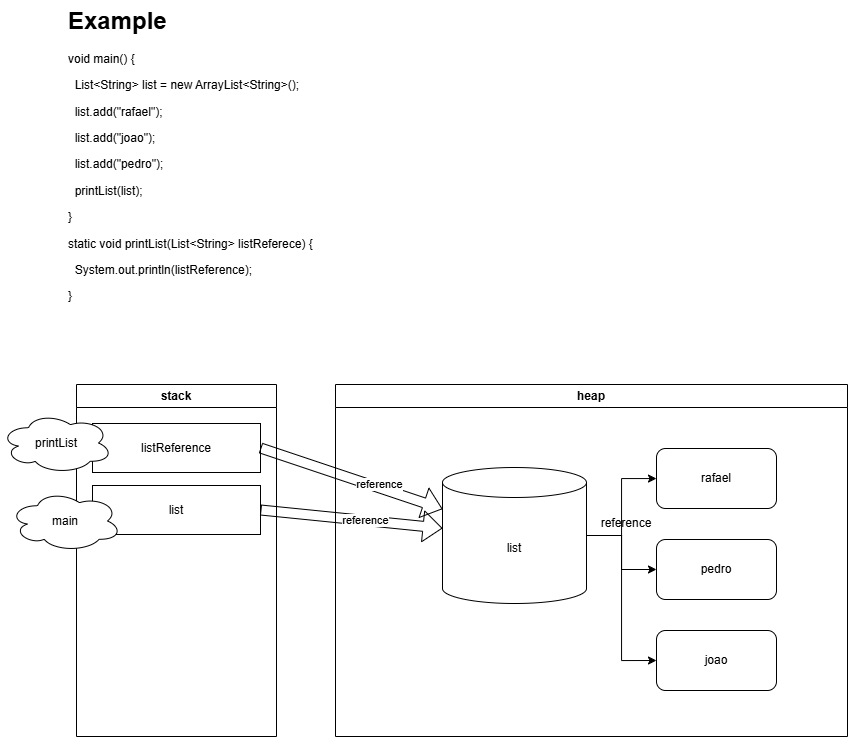

# Java Performance Tuning


- Choose the right JVM
- Programming/execution environment

## JIT and Code Cache

- Main.java -> javac -> Main.class (compiles)
- JVM interprets Main.class
- Just-in-time compilation (JIT)
  - When a branch runs often
  - JVM decides to compile into native code specific to the OS (runs faster)
  - Code runs faster the longer it is left to run (long-running apps get profiled by JVM)
  - Any block of code can be JIT compiled
  - `-XX:+PrintCompilation` shows which compilation is being made


### example of `-XX:+PrintCompilation`

```txt
    24    1       3       java.util.concurrent.ConcurrentHashMap::tabAt (22 bytes)
     24    3     n 0       jdk.internal.misc.Unsafe::getObjectVolatile (native)   
     25    2       3       jdk.internal.misc.Unsafe::getObjectAcquire (7 bytes)
```

- first column: number of milliseconds since JVM started
- second column: compilation ID
- third column: compilation mode: 
  - `n` means native method (non-Java implementation, like C/C++)
  - `s` synchronized method
  - `!` method has been deoptimized
  - `%` high-level optimization (OSR - On Stack Replacement)
    - **Note:** OSR specifically replaces the running code on the stack with optimized version, typically for long-running loops
  - `made not entrant` deoptimized, no longer hot
- fourth column: compilation level [0-4]
- last column: method name




- The JVM decides which level should be used; the more a method is used, the higher the probability it will be promoted to a higher compilation level
- To save compilation logs to a file: `-XX:+UnlockDiagnosticVMOptions -XX:+LogCompilation`

### Code cache (or CodeHeap)

- Area where JVM stores bytecode compiled into native code
- Set the code cache:
  - `-XX:InitialCodeCacheSize=28M` when app starts, e.g.: 
  - `-XX:ReservedCodeCacheSize` max code cache
  - `-XX:CodeCacheExpansionSize` how fast the cache should grow
- Warning if the code cache is full: `VM warning: CodeCache is full.`
- `-XX:+PrintCodeCache` shows the code cache usage and available space
  - Java 8+ code cache up to 240MB
  - **Note:** Default code cache size varies by JVM version and platform. Java 9+ may have different defaults.

### Jconsole

- Allows you to connect to a Java process running locally or remotely
- Shows heap, code cache, etc.
- Location, e.g.: `C:\Program Files\Java\jdk-21.0.10\bin\jconsole.exe`
- :warning: Connecting to JVM causes performance degradation to the running JVM
  - The JVM connects to `jconsole` and the communication can impact the application

### 32 bits vs 64 bits

- client compiler = short-running app
- server compiler = long-running app
- `-client` faster startup (no tier 4 compilation)
  - e.g., `java -client`
- `-server` or `-d64` can be used

| 32 bit                    | 64 bit                             |
|---------------------------|------------------------------------|
| faster for heap < 3GB     | faster for long/double             |
| max heap size 4GB         | Mandatory for heap > 4GB           |
| -                         | max heap size depends on OS        |
| client compiler only (C1) | client and server compiler (C1/C2) |

**Note:** 32-bit JVM support has been removed in recent Java versions (Java 11+). Modern applications typically use 64-bit JVMs.


### TieredCompilation



- `-XX:-TieredCompilation` use + to enable or - to disable
- Run the process only in interpreter mode

#### Tuning Native Compilation on VM

- `java -XX:+UnlockDiagnosticVMOptions -XX:+PrintFlagsFinal` shows all flags and their default values
- `jinfo -flag CICompilerCount <process-id>`
  * shows the flag for a running app; in this case, threads for compilation
- `-XX:CICompilerCount=<number>`
  * sets the number of threads for compilation (minimum of 2 threads)
- `-XX:CompileThreshold=<number>`
  * sets the number of times the method must run before the JVM tries to optimize it
- `-XX:TieredStopAtLevel=<number>` setting to 1 will disable the `C2` compiler
- `-Xint` disables all JIT compilation, interpreter mode only

#### Default Values of Tiered Compilation

Specifies the number of times the method must run before JIT tries to optimize (bytecode to machine code)

```bash
java -XX:+PrintFlagsFinal -version | grep CompileThreshold
intx CompileThreshold = 10000 # legacy flag
intx Tier2CompileThreshold = 0
intx Tier3CompileThreshold = 2000
intx Tier4CompileThreshold = 15000
```

### Java memory

- stack (stack machine based)
  - data structures (First in last out)
  - every thread has its own stack
  - passing primitives to methods actually copies the value, there is no pointer/reference
  - local primitives
- heap
  - complex objects (not stored in stacks)
  - pointer/reference
  - local objects will be stored as reference in the stack
- metaspace


```java
void main() {
  int number = 1;
  String description = "one";
}
```

In the example above for the stack:

- push [int number] (value stored directly on stack)
- heap [String description] (object stored in heap)
- push [description reference] (reference stored on stack)

#### Java stack example





```java
void main() {
  int value = 12;
  calculate(value);
  System.out.println(value); // will print 12 because primitive is always a copy
}

static void calc(int someValue) {
    someValue = someValue * 100;
}
```

## The final keyword

- potentially optimizes performance [inlining]
  - inlining: Java replaces the reference with its actual constant value at compile time
- cannot be re-assigned
- JVM can inline non-final methods (through runtime profiling)

## Escaping References (Reference Scape)

- Object becomes accessible outside the intended scope
- Can allow uncontrolled or unsafe access to an object

```java
public class AllowedPersonal {
  private Map<String, Person> personMap;

  public AllowedPersonal() {
    this.personMap = new HashMap<>();
  }

  public void addPerson(Person person) {
    this.personMap.put(person.id, person);
  }

  public Map<String, Person> getPersonMap() {
    // escaped reference!!! exposing internal structure
    return this.personMap;
  }
}
```

- Avoid returning pointers to internal structures
- Use defensive copies e.g.: `return Collections.unmodifiableMap(this.personMap);`
  * May impact performance
  * `return Map.copyOf(this.personMap);` for java 10+ (this version checks if the collection is already unmodifiable)
- In the example above, can make `AllowedPersonal` iterable e.g.: `AllowedPersonal implements Iterable<Person>`
  * Still possible to remove/mutate the internal state with `iterator.next();iterator.remove();`

## The Metaspace

- Stores metadata in general (class definitions, method information, etc.)
- static variables (Objects in heap but the pointer in metaspace, primitives entirely in metaspace)
- Metaspace is not accessible by programmers (not collected by GC in the same way as heap)
  - **Note:** While metaspace can be garbage collected when classes are unloaded, this is rare in typical applications
- Java 7 or below, PermGen was used (can get full and throw OutOfMemoryError)
  * `-XX:PermSize=<NUMBER>` and `-XX:MaxPermSize=<NUMBER>` is no longer valid for Java 8+

### String pools

- Java automatically optimizes string objects by identifying duplicated strings and not recreating them
- Strings are immutable
- `"76" == String.valueOf(76)` is false, calculated values don't get set in the string pool
  * can be optimized in the future after some JVM iterations
- `"76" == String.valueOf(76).intern()` is true, the `intern` method checks the presence in string pool
  * **Note:** Using `intern()` can have performance implications if overused, as it adds strings to the string pool which is managed by the JVM
- The string pool stores values based on hash codes
  * hash table in string pool has a size

#### String pools flags

- Java 11+ dynamically sized based on heap
- `-XX:+PrintStringTableStatistics`
- `-XX:StringTableSize=<NUMBER>` prime numbers are a better option
  * if average bucket size > 40 should increase
  * table size cannot be bigger than heap size
- `-XX:MaxHeapSize=4GB` or `-Xmx4GB`
- `-XX:InitialHeapSize=4GB` or `-Xms4GB`

## Garbage Collection (GC)

- deletes objects that are no longer needed
- Java is managed (memory)
- objects in heap that are no longer reachable in the stack are eligible for GC
- `System.gc()` suggests GC to the JVM but doesn't guarantee the GC will run
- In Java 11+, GC gives unused memory back to OS (small heap)
  - set `-Xms` to guarantee that the heap never goes lower than specified (increasing heap costs OS operations)
- method `finalize()` is called on object GC cleanup. Deprecated since Java 9+
  - finalize may not be called if the application shuts down
  - **Note:** `finalize()` is removed in Java 18+. Use `Cleaner` API or try-with-resources for resource management instead.
