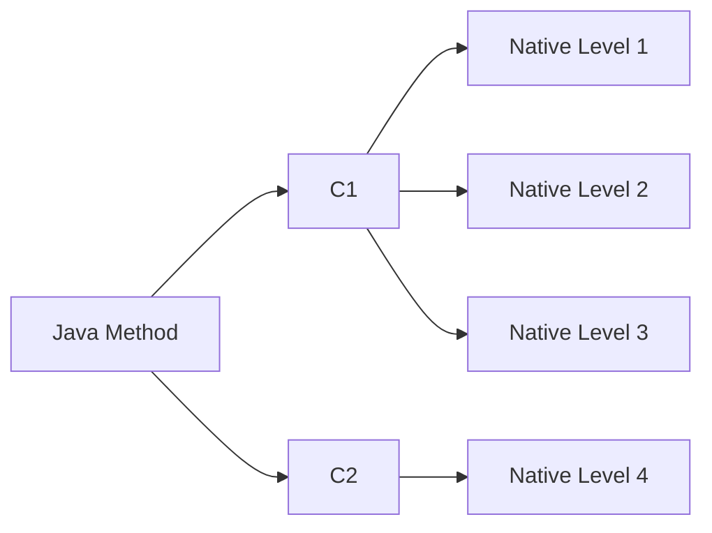
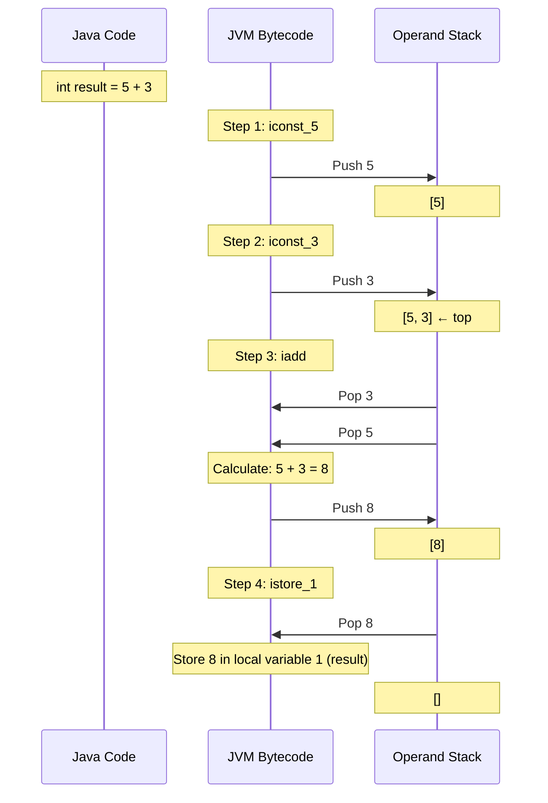

# java performance tunning


- choose right jvm
- programming/execution environment

## JIT and Code cache

- Main.java -> javac -> Main.class (compiles)
- JVM interpreter Main.class
- Just in time compilation (JIT)
  - branch runs often
  - jvm decides to compile into native code specific for OS (runs faster)
  - Code runs faster the longer it is left to run (long-running apps gets profiled by jvm)
  - any code block of code can be JIT compile
  - `-XX:+PrintCompilation` show which compilation is being made


### example of `-XX:+PrintCompilation`

```txt
    24    1       3       java.util.concurrent.ConcurrentHashMap::tabAt (22 bytes)
     24    3     n 0       jdk.internal.misc.Unsafe::getObjectVolatile (native)   
     25    2       3       jdk.internal.misc.Unsafe::getObjectAcquire (7 bytes)
```

- first column: number of milliseconds since JVM started
- second column: compilation Id
- third column compilation mode: 
  - `n` means native method (non-java impl, like C/C++)
  - `s` synchronized method
  - `!` deoptimized, interpreter
  - `%` high-level optimization
  - `made not entrant` de-optimized, non-hot
- fourth column: compilation level [0-4]
- last column: method name




- Jvm decides which level should be used, more used higher the probability to increase the level
- To save into a log file = `-XX:+UnlockDiagnosticVMOptions -XX:+LogCompilation`

### Code cache (or CodeHeap)

- Area where JVM stores bytecode compiled into native code
- Set the code cache:
  - `-XX:InitialCodeCacheSize=28M` when app starts eg: 
  - `-XX:ReservedCodeCacheSize` max code cache
  - `-XX:CodeCacheExpansionSize` how fast the cache show grow
- Warning if the code cache is full: `VM warning: CodeCache is full.`
- `-XX:+PrintCodeCache` shows the code cache usage and available
  - java8+ code cache up to 240MB

### Jconsole

- Allows to connect to a java process running locally or remote
- Shows heap, code cache, etc
- location e.g.: `C:\Program Files\Java\jdk-21.0.10\bin\jconsole.exe`
- :warning: connecting to jvm causes performance degradation to the running JVM
  - The jvm connects to `jconsole` and the communication can impact the application

### 32 bits vs 64bits

- client compiler = short running app
- server compiler = long running app
- `-client` faster startup (no tier 4 compilation)
  - eg `java -client`
- `-server` or `-d64` can be used

| 32 bit                   | 64 bit                            |
|--------------------------|-----------------------------------|
| faster for heap < 3GB    | faster for long/double            |
| max heap size 4GB        | Mandatory for heap > 4GB          |
| -                        | max heap size depends on OS       |
| client compiler only(c1) | client and server compiler(c1/c2) |


### TieredCompilation


- `-XX:-TieredCompilation` on or off for + and -
- Run the process only on interpreter mode

#### Tuning Native compilation on VM

- `java -XX:+PrintFlagsFinal` show all flags and default values
- `jinfo -flag CICompilerCount <process-id>`
  * shows the flag for running app, in this case threads for compilation
- `-XX:CICompilerCount=<numeber>`
  * sets the number of threads to compilation (min of 2 threads)
- `-XX:CompileThrshold=<number>`
  * sets the amount of time the method must run until jvm tries to optimize
- `-XX:TieredStopAtLevel=<number>` setting to 1 will disable `c2` compiler
- `-Xint` disable all JIT compiler, only interpreter mode

#### Default values of tiered compilation

```bash
java -XX:+PrintFlagsFinal -version | grep CompileThreshold
intx CompileThreshold = 10000
intx Tier2CompileThreshold = 0
intx Tier3CompileThreshold = 2000
intx Tier4CompileThreshold = 15000
```

### Java memory

- stack (stack machine based)
  - datastructures (First in last out)
  - every thread has its own stack
  - passing primitives to methods actually copies the value, there is no pointer/reference
  - local primitives
- heap
  - complex objects (not stored in stacks)
  - pointer/reference
  - local objects will be stores as reference in the stack
- metaspace


```java
void main() {
  int number = 1;
  String description = "one";
}
```

In the example above to stack:

- push [int number]
- heap [String description]
- push [description reference]

#### Java stack example




```java
void main() {
  int value = 12;
  calculate(value);
  System.out.println(value); // will print 12 because primitive is always a copy
}

static void calc(int someValue) {
    someValue = someValue * 100;
}
```

### final keyword

- potentially optimize performance [inlining]
  - inlining java replaces the reference with its actual constant value
- cannot be re-assign
- JVM can inline non-final methods
