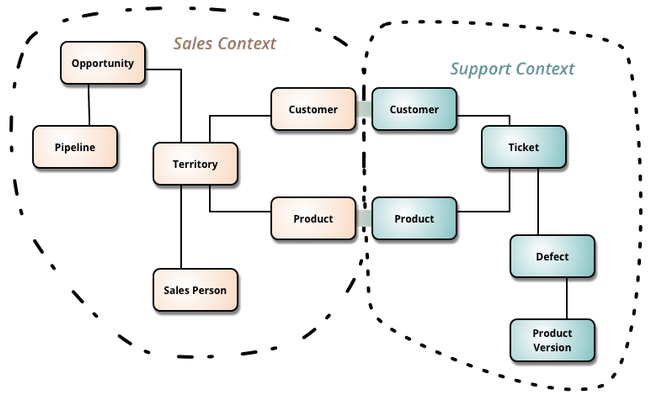
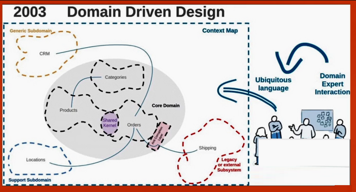

# DDD com java

- Livro eric evans - questões de dominio e dificil de ler
- Desenvolver orientado a dominio
- Destacar dominios
- Dificuldade de achar no codigo os conceitos de negocio

# O que tem?

- Foco no domínio
- Linguagem ubíqua = Linguagem comum
- Contexto delimitado
- Blocos de construção

- Entity = something that doesnt change through time, always the same (pokemon)
- Value Object = immutable, identified by all attributes (pokemon move)
- Repository = Storage, interface
- Factory = in case of complex object to construct
- Service = coordinate tasks, use cases (avoid complex business logic in service)

## Linguagem Ubiqua

- conversar utilizando termos de negocio
- ficar claro e dar enfase no dominio
- intersecção entre domino de negocio e tecnico
- Invariante = Regra de negocio que deve ser verdadeira para o objeto ser válido
- Aggregate root = e.g. Aluno raiz de coleções dos agregados
  - e.g. garantir que a manipução dos objetos do agregado seja minupulada apenas
  - de dentro do agregado. Cuidado com métodos gets e sets
  - Aggregate is a cluster of domain objects and can be treated as a single unit
  - Todas operações serem feitas pelo Aggregate root. E.g.: Alunos + Telefones

## Eventos

- Algo que aconteceu ou algum tratamento/processamento, mais de um ouvinte
- e.g.: sempre que um aluga é registrado, é um evento

## Contextos delimitados

- Separação por contexto.

e.g.:

- Separar os contexto por package, modulo (java9) ou até modulos do maven. Ou até microservios diferentes.
- Ex: Acadêmico (Aluno, Escola) e Gameficação (selos), separar por modulos. Tomar cuidado para um modulo não depender do outro
  - Academico (aluno) -> CPF <- Gameficação (selo) | Acoplamento pelo CPF
  - Ou duplicar CPF
- Mapa de contextos: CRM/Locations/Shipping/CORE(Categorias, Ordens, Produtos):

### Context Map:

## ACL Anti-Corruption Layer

- Usado em integrações, de-para de termos, n gerar acoplamento
