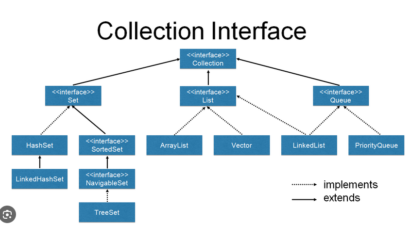

## Dynamics

* Permite usar variaveis de forma simples usando o 
conceito de inferência de tipos, ou seja, o compilador verifica o tipo de atribuição e automagicamente entende o tipo
    - ex: var name = "emilio";

* {{int teste = 1; System.out.println(teste)}} executar código em compilação, possível colocar e chamar trechos de código dentro do contexto
do método: var list = new ArrayList<String>() {{ add("yep, it works..."); }};

* Dimand operator = <>

* Ghost Class, classe on the fly : var o = new Object() {public String name = "rafael"; public String getName() {return name}};

* var é pra ser usado em escopo local, pode ser passado mas deve ser feito

* collections => dicts, mapas, filas, listas etc, HashMaps e SortedMaps
    - Iterable<t>
        - Collections<T>
            - Set<E>
                - SortedSet <E>
            - List<E>
            - Queue<E>

    - Map<K,V>
        - SortedMap<k,v>
        - ConcurentMap<k,v>


# Debugging in intelliJ

- blue name in the variables session indicates that the variable has been updated
- u can show or hide watchers
- setting a breaking point into a field adds a watcher and when a update happens, break activates
    - possible to change between field change or accessed

## import static

- useful to import static member of classes without having to specify the whole name.

### Example:

```java

public class ClassWhatever {
    public static void someMethod() {
        System.out.println("invoked");
    }
}
```

```java
import static com.example.ClassWhatever.someMethod;

public class AnotherClass {
    public void anotherMethod() {
        someMethod(); // called without having to specify the class
    }
}


```

## private, public and no explicit modifier

- private: only for inner class and available only for the member inside that class
- public: accessible for any other class in any other package
- no explicit modifier: only accessible within the same package


## Collections

- java.util.Arrays isn't considerate part of collection
- all collection of objects implements Collection but Maps
- collection interface: defines the default behavior for a collection (like add, clear, remove, etc)
- Collection is the lowest level of abstraction where: Collection->List->ArrayList(Concrete)
- Sort is not part of Collection


